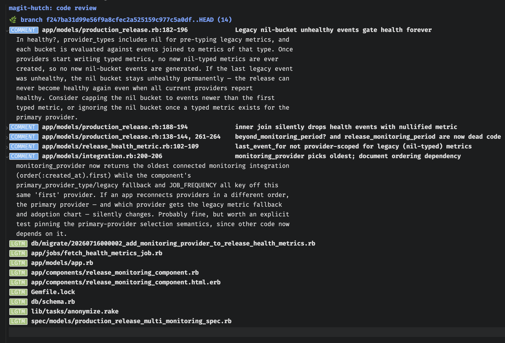

#+title: magit-hutch: a native code-review interface for magit

=hutch= is a code-review agent that runs inside emacs. Invoke it from a [[https://magit.vc][magit]] buffer and get a granular review around the files changed. This can be used as a developer-local review tool before code is published to forges, or other external review harnesses.

It sends a manifest of changed files (not full diffs) and lets the agent fetch what it needs. The agent has access to the following tools:

1. =read_diff= — fetch the full diff for a specific file
2. =search_codebase= — git grep (POSIX extended regex) for patterns
3. =read_file= — read file contents (optionally a line range)
4. =surrounding_context= — Tree-sitter enclosing definition lookup
5. =git_log= — recent commit history for a file
6. =git_blame= — blame for a file or line range

Tools are run with baked-in guardrails to not overburden context length. Hutch performs competitively on Martian's offline benchmarks (see [[/eval/README.org][eval]]). Most code review benchmarks tend to focus on human-like comment quality, but hutch prioritizes patch applicability over just comments. Hutch tries hard to create valid, verifiable patches that can be immediately applied to assist the _magit → review → magit_ workflow. Hutch is more valuable to people still hand-writing code, or exclusively using magit to review/stage changes, this adds a piece in those pipelines.

** Installation

=hutch= uses [[https://github.com/karthink/gptel][gptel]] to talk to LLM backends.  Pick an install method
that handles deps for you (=straight.el=, =elpaca=) — they'll pull in
=magit=, =gptel=, and =svg-lib= automatically.  We recommend SOTA models
only, since the output from cheaper models can be unreliable.

*Tree-sitter grammars (optional but recommended):* the
=surrounding_context= tool uses tree-sitter to resolve the enclosing
definition for a hunk.  It returns a "no grammar" sentinel for any
language whose grammar isn't installed, so the tool degrades gracefully
— but reviews are noticeably better with grammars present.  Install
once per language via =M-x treesit-install-language-grammar= (requires
=git= and a C compiler).  Or install everything in one shot from a
cloned checkout: =bin/install-grammars=.  Hutch currently has explicit
support for: python, javascript, typescript, tsx, go, ruby, rust, java,
c, c++, clojure, elixir (elisp is built-in and needs no grammar).

*** straight.el
#+begin_src emacs-lisp
(use-package hutch
  :straight (hutch :host github :repo "adjaecent/magit-hutch")
  :config
  (setq hutch-backend
        (gptel-make-anthropic "Claude"
          :key (getenv "ANTHROPIC_API_KEY")
          :models '(claude-sonnet-4-6))))
#+end_src

*** elpaca
#+begin_src emacs-lisp
(use-package hutch
  :ensure (hutch :host github :repo "adjaecent/magit-hutch")
  :config
  (setq hutch-backend
        (gptel-make-anthropic "Claude"
          :key (getenv "ANTHROPIC_API_KEY")
          :models '(claude-sonnet-4-6))))
#+end_src

*** package-vc (Emacs 29+ built-in)

=package-vc-install= resolves the =Package-Requires= deps (=gptel=,
=svg-lib=) via =package-archives=.  Two requirements: MELPA must be
enabled, and the package index must be fresh — MELPA only hosts the
current snapshot, so stale index entries 404 when fetched.

#+begin_src emacs-lisp
(require 'package)
(add-to-list 'package-archives '("melpa" . "https://melpa.org/packages/") t)
(package-initialize)

;; Refresh the index so package-vc resolves to currently-hosted tarballs.
;; Without this you may see 404s like 'gptel-YYYYMMDD.HHMM.tar Not found'.
(unless package-archive-contents
  (package-refresh-contents))

(unless (package-installed-p 'hutch)
  (package-vc-install "https://github.com/adjaecent/magit-hutch"))

(with-eval-after-load 'hutch
  (setq hutch-backend
        (gptel-make-anthropic "Claude"
          :key (getenv "ANTHROPIC_API_KEY")
          :models '(claude-sonnet-4-6))))
#+end_src

If the install still 404s, run =M-x package-refresh-contents= manually
and retry — that forces a refresh regardless of cached state.

*** Manual clone

Install =magit=, =gptel=, and =svg-lib= via your usual package manager,
then add =hutch= to your =load-path=:

#+begin_src emacs-lisp
(add-to-list 'load-path "~/path/to/magit-hutch")
(require 'hutch)

(setq hutch-backend
      (gptel-make-anthropic "Claude"
        :key (getenv "ANTHROPIC_API_KEY")
        :models '(claude-sonnet-4-6)))
#+end_src

** Backend examples

Any =gptel-make-*= backend works for =hutch-backend=. Following are the recommended models for good quality reviews:

#+begin_src emacs-lisp
;; Anthropic Claude
(setq hutch-backend
      (gptel-make-anthropic "Claude"
        :key (getenv "ANTHROPIC_API_KEY")
        :models '(claude-opus-4-8)))

;; OpenAI
(setq hutch-backend
      (gptel-make-openai "OpenAI"
        :key (getenv "OPENAI_API_KEY")
        :models '(gpt-5.5)))

;; OpenRouter (gateway for many models, e.g. DeepSeek)
(setq hutch-backend
      (gptel-make-openai "OpenRouter"
        :host "openrouter.ai"
        :endpoint "/api/v1/chat/completions"
        :key (getenv "OPENROUTER_API_KEY")
        :models '(deepseek/deepseek-v4-pro)))
#+end_src

*** Reasoning / extended thinking

Hutch's review loop is multi-step and benefits from reasoning models.
Each provider's reasoning knobs are different — pass them via
gptel's =:request-params=, which gets merged into every request body.

*Anthropic* — extended thinking with a token budget. =gptel= correctly
preserves thinking signatures across tool-use turns, which Claude
requires (see [[https://github.com/ahyatt/llm/discussions/273][llm
discussion #273]] for the surrounding context).

#+begin_src emacs-lisp
(setq hutch-backend
      (gptel-make-anthropic "Claude"
        :key (getenv "ANTHROPIC_API_KEY")
        :models '(claude-opus-4-8)
        :request-params '(:thinking (:type "enabled" :budget_tokens 2048))))
#+end_src

Notes for Claude:
- =budget_tokens= minimum is 1024; sensible defaults are 2048-4096 for review loops.
- =temperature= must be 1 when thinking is enabled (gptel's default).

*OpenAI* — =reasoning_effort= (=minimal= / =low= / =medium= / =high=).
Note: =gpt-5.5= specifically rejects =reasoning_effort= alongside tools
on the =/v1/chat/completions= endpoint (it wants =/v1/responses=,
which gptel does not currently support). =gpt-5.1= and other earlier
reasoning models accept it on chat/completions.

#+begin_src emacs-lisp
(setq hutch-backend
      (gptel-make-openai "OpenAI"
        :key (getenv "OPENAI_API_KEY")
        :models '(gpt-5.1)
        :request-params '(:reasoning_effort "low")))
#+end_src

*OpenRouter* — unified =:reasoning= abstraction that maps to each
underlying provider's native param.  Forms: =(:effort "low/medium/high")=,
=(:max_tokens N)=, =(:enabled t)=, =(:exclude t)=.  No params needed for
=deepseek/deepseek-v4-pro= — it reasons at =high= effort by default
([[https://api-docs.deepseek.com/guides/thinking_mode][DeepSeek docs]]).

#+begin_src emacs-lisp
;; Example: cap reasoning tokens on a Claude-family OpenRouter model
(setq hutch-backend
      (gptel-make-openai "OpenRouter"
        :host "openrouter.ai"
        :endpoint "/api/v1/chat/completions"
        :key (getenv "OPENROUTER_API_KEY")
        :models '(anthropic/claude-sonnet-4-6)
        :request-params '(:reasoning (:max_tokens 2048))))
#+end_src

** Configuration
#+begin_src emacs-lisp
(use-package hutch
  :straight (:host github :repo "adjaecent/magit-hutch")
  :after magit
  :config
  (setq gptel-log-level 'info)
  (setq hutch-backend
        (gptel-make-openai "OpenAI"
          :key (getenv "OPENAI_API_KEY")
          :models '(gpt-5.5)))
  ;; staged: review staged changes
  ;; unpushed: commits not yet pushed upstream
  ;; branch: commits in this branch not merged against default branch (main, master etc.)
  (setq hutch-scopes '(:staged :branch))
  ;; number of rounds before the agent gives up, 40 is default
  (setq hutch-max-tool-rounds 20)
  ;; optional tools the agent can call.  Defaults to (search-codebase
  ;; surrounding-context).  read-file is opt-in (can blow context),
  ;; git-log/git-blame are available but disabled by default.
  (setq hutch-enabled-tools '(read-file search-codebase surrounding-context))
  ;; bind under `d R' in the `magit-diff' transient (default key is "R")
  (hutch-add-review-binding))

#+end_src

** Usage

|--------------+-------------------------------------------+--------------------------------------------|
| where        | shortcut                                  | action                                     |
|--------------+-------------------------------------------+--------------------------------------------|
| magit buffer | =d= followed by your bound key (e.g. =R=) | start a review for enabled scopes          |
| hutch buffer | =C-c C-k=                                 | cancel review                              |
| hutch buffer | =m=                                       | queue a suggestion to be applied           |
| hutch buffer | =A=                                       | bulk-apply all patch suggestions           |
| hutch buffer | =x=                                       | dismiss a review suggestion (collapses)    |
| hutch buffer | =TAB=                                     | open/close a review (and underlying nests) |
|--------------+-------------------------------------------+--------------------------------------------|

** Roadmap

*** Persistent reviews
Persist reviews under =refs/hutch/<branch>= with a session id at commit time. Past review findings are fed back as context: the model sees "last review flagged X in this file, author accepted/rejected it." This prevents re-flagging dismissed issues, catches recurring patterns, and detects whether previous suggestions were actually addressed.

*** Context graph
A dependency graph of the codebase built lazily as the agent explores. Nodes are files/functions with content hashes, edges are relationships (calls, imports, tests). Used for three things: fetching relevant context (walk forward edges), invalidating stale cache (walk reverse edges), and grouping related files for joint review (connected components). Persisted to =refs/hutch/<branch>= between runs.

*** Composable tool primitives
Instead of hardcoding every tool, expose primitives (git, tree-sitter, file I/O) and let the model compose them. The model writes elisp in a sandboxed eval to build custom queries on the fly — "find all callers of this function that don't handle the nil case." Tools that generate tools.

** LLM-usage disclosure

Most of the UI and tool code is written in an AI-assisted way, but carefully examined. The rest of the agentic and operational code is largely hand-written.
